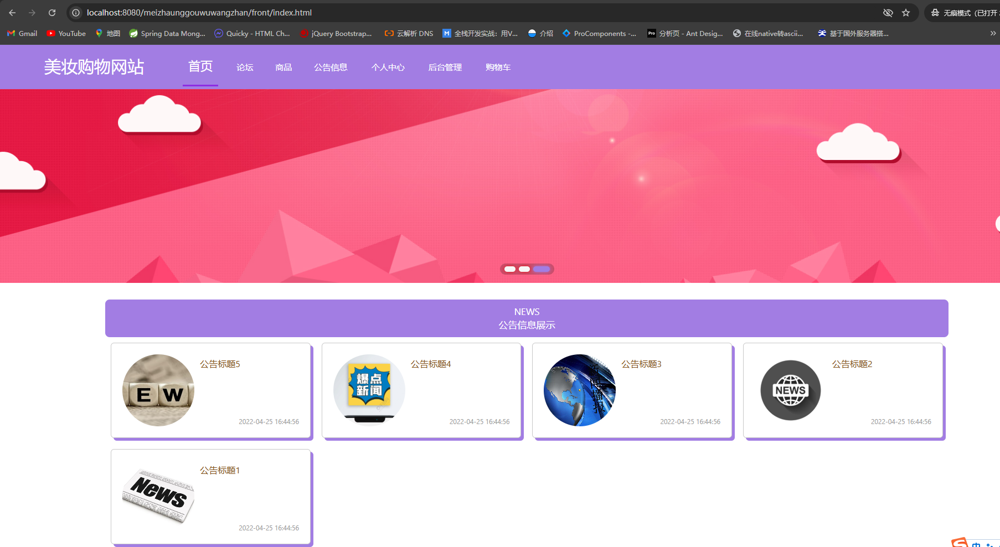
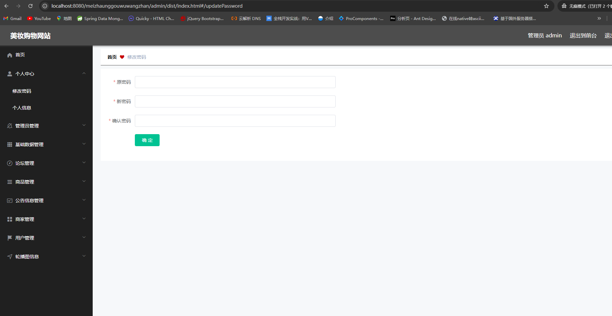
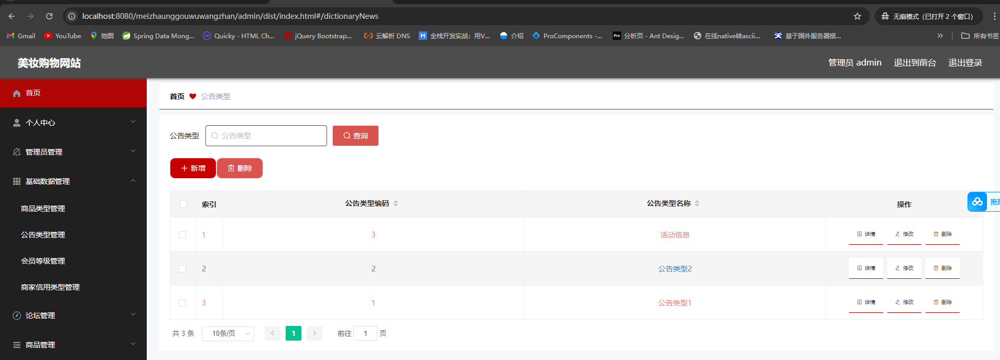

适合初学同学练手项目，部署简单，代码简洁清晰；

愿世界和平再无bug

# 一、系统架构

######      前端：vue| elementui

######      后端：springboot | mybatis-plus   

######      环境：jdk1.8+ | mysql | maven

# 二、登录角色

###### 1.管理员

###### 2.商家

###### 3.用户

# 三、代码及数据库

# 四、相关功能介绍

#### 1.用户端

###### (1).首页

###### (2).论坛

###### (3).商品

###### (4).公告信息

###### (5).个人中心

###### (6).收货地

###### (7).商品收藏

###### (8).商品订单

###### (9).购物车

#### 2.管理端

###### (1).登录

###### (2).商家注册

###### (3).用户注册

###### (4).首页

###### (5).修改密码

###### (6).管理员管理

###### (7).商品类型管理

###### (8).公告类型管理

###### (9).会员等级管理

###### (10).商家信用类型管理

###### (11).论坛管理

###### (12).商品管理

###### (13).商品评价管理

###### (14).商品收藏管理

###### (15).商品订单管理

###### (16).公告信息管理

###### (17).商家管理

###### (18).用户管理

###### (19).轮播图管理

#### 3.商家端

###### (1).修改密码

###### (2).个人信息

###### (3).论坛管理

###### (4).商品管理

###### (5).商品评价管理

###### (6).商品收藏管理

###### (7).商品订单管理

###### (8).公告信息管理

